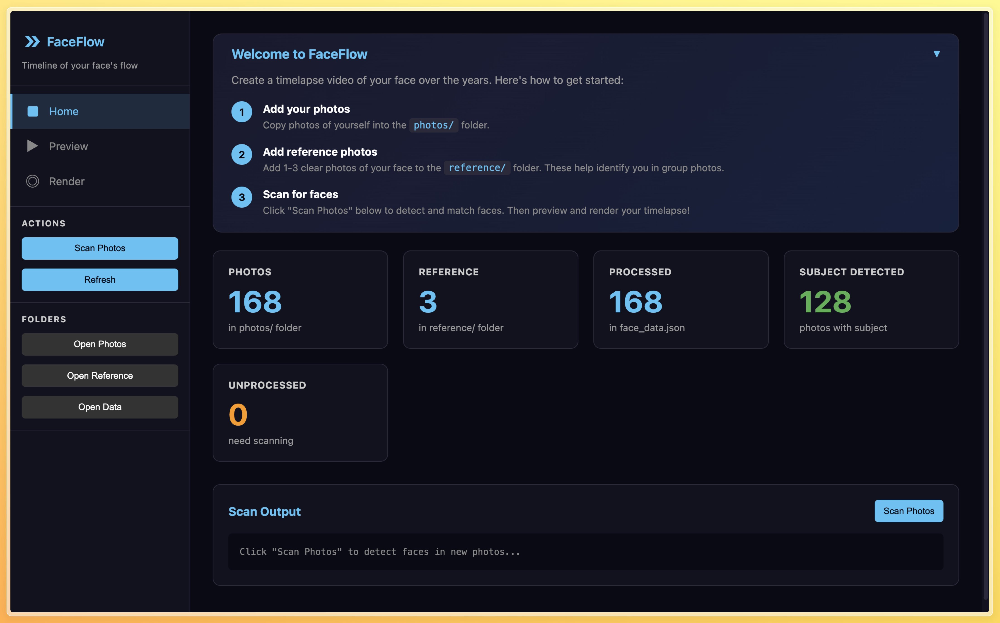

<p align="center">
  
</p>

<p align="center">
  Create stunning timelapse videos of your face over the years.<br>
  Automatically detects faces, aligns them consistently, and displays your age.
</p>



## Features

- **Automatic Face Detection** — Uses face_recognition to find and match your face across photos
- **Smart Alignment** — Faces are automatically scaled and rotated for smooth transitions
- **Age Display** — Shows your exact age on each frame based on photo dates
- **Video Export** — Render to MP4, GIF, or PNG sequence with customizable settings
- **Manual Corrections** — Fix detection errors with the landmark editor
- **Privacy First** — Everything runs locally, your photos never leave your machine


## Quick Start

```bash
# Setup
python -m venv venv && source venv/bin/activate
pip install -r requirements.txt

# Run
python server.py
# Open http://localhost:8080/web/
```

## Usage

1. **Add Photos** — Copy your photos into the `photos/` folder
2. **Add References** — Add 1-3 clear photos of your face to `reference/` for identification
3. **Scan** — Click "Scan Photos" on the Home page to detect and match faces
4. **Preview** — Browse your timeline, adjust alignment settings
5. **Render** — Export your timelapse video

## Requirements

- Python 3.8+

## Project Structure

```
faceflow/
├── photos/              # Your photos to analyze
├── reference/           # 1-3 clear reference photos
├── data/
│   └── face_data.json   # Detection results + birth date
├── src/
│   └── detect_faces.py  # Face detection script
├── web/                 # Web UI
├── out/                 # Rendered videos
├── server.py            # HTTP server with API
└── requirements.txt
```

## Keyboard Shortcuts

| Key | Action |
|-----|--------|
| `←` `→` | Navigate photos |
| `Mouse wheel` | Adjust face scale |
| `1` `2` `3` | Select landmark (edit mode) |
| `Esc` | Cancel editing |

## License

MIT
